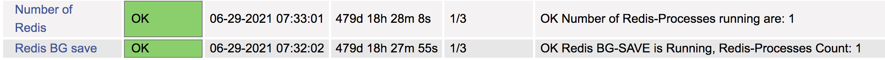
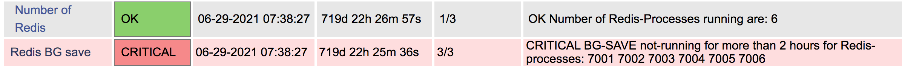

## Overview
This repo contains the following set of Nagios plugins to monitor Redis Server:
1. Plugin to verify if one or more given redis processes are running.
2. Plugin to verify if 'Bgsave' was completed within the given duration for one or more redis processes (queries the 'lastsave' timestamp)

## Example output

```
$ ./check_redis_process.sh
OK Number of Redis-Processes running are: 3
 
$ ./check_redis_bgsave.sh
OK Redis Bgsave is Running, Redis-Processes Count: 3
```

## Dependencies
This plugin uses 'redis-cli' to gather [lastsave](https://redis.io/commands/LASTSAVE) timestamp for Bgsave.

## Configuration
1. Copy scripts to NRPE plugin directory: "/usr/lib/nagios/plugins/"
2. NRPE config entry: "/etc/nagios/nrpe.cfg"
```
command[check_redis]=/usr/lib/nagios/plugins/check_redis_process.sh
command[check_bgsave]=/usr/lib/nagios/plugins/check_redis_bgsave.sh
```
3. Example Nagios-server configuration
```
define service {
        use                      local-service
        host_name                <remote_linux_host>
        service_description      Redis processes
        check_command            check_nrpe!check_redis
}

define service {
        use                      local-service
        host_name                <remote_linux_host>
        service_description      Redis Bgsave
        check_command            check_nrpe!check_bgsave
}

define command {
        command_name              check_nrpe
        command_line              $USER1$/check_nrpe -H $HOSTADDRESS$ -c $ARG1$
}
```

## Nagios UI screenshots


